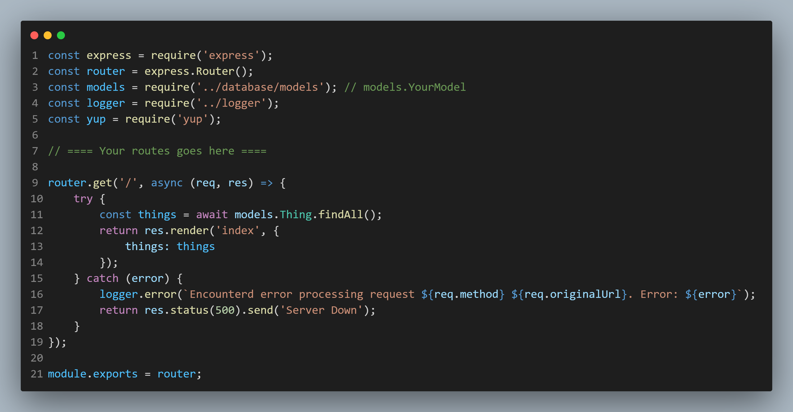
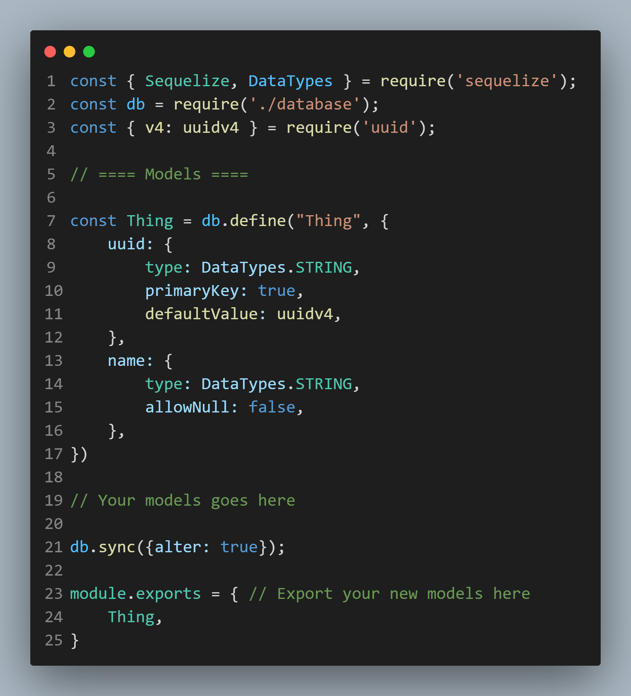
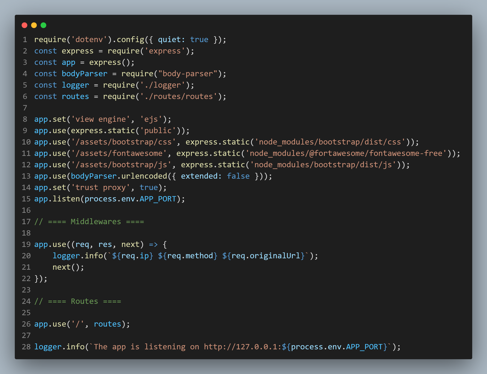

# Aziz.js
> A custom, lightweight, pre-configured Node.js framework for building web applications.

This is a pre-configured Express.js environment for building web MVPs and personal solutions.

## About

I have built multiple apps using Express.js. I noticed that I spend a lot of time configuring things. So I built this "framework" which contains everything I need to quickly build my apps:
- HTTP server using **Express.JS**
- Server Side Rendering using **EJS**
- **Sequelize** ORM with **SQLite**
- And more

Calling it a framework is an exaggeration, it's just a bunch of libraries glued together and ready to use.

## Libraries:

I have built this framework for my personal use and needs. I installed and configured the following libraries to run out-of-the-box:

- **Express.js**: A pre-configured, ready-to-serve Express.js environment, with the necessary configurations (body-parser, express.static, etc.) 

- **EJS**: Ready-to-use templating engine.

- **Sequelize**: Pre-configured using sqlite and ready to run, just write your models in `database/models.js`.

- **Winston**: Pre-configured logging system for every request, use `logger.info("Message")` anytime you want to log something.

- **Yup**: For backend validation.

- **Bootstrap 5.3 @ Fontawesome Free 7.1**: Installed and served from within Express.js.

## Structure

- **`database/`**: Everything related to the database is here. You'll spend most of your time building models and relationships in `database/models.js`.

- **`public/`**: Everything public will be here, like static files (`.css`, `.js`, `.png`, etc.)

- **`routes/`**: All your Express.js routes will be here. 

- **`storage/`**: A storage place for your logs.

- **`views/`**: Your `.ejs` views and partials will be here.

## Relevant Files

Here is a list of files you most likely will spend most of your time on: 

- **`routes/routes.js`**: Your core logic will likely be here, you will spend most of your time taking requests, making database calls, and returning things. You can access `models.YourModel` here after creating and exporting them from `database/models.js`.

- **`database/models.js`**: Here you will configure your database schema, including models and relationships.

- **`server.js`**: The glue that connects everything together, you will run this file to run the app. Use `npm start` to start the application.

- **`logger.js`**: The logging system is here; currently it is set to save logs as `log` files. You can change the log formatting here. It exports `logger` object  ready to use.

## TODOS

- Simple authentication system out-of-the-box

## TL;DR

It's the Express.js setup I wish existed when I started.

**What this is:**
- A starter template for rapid prototyping.
- Not a production framework, it's a personal productivity tool.

**What this is NOT:**
- A replacement for larger frameworks (Laravel, Nest.js, etc.).
